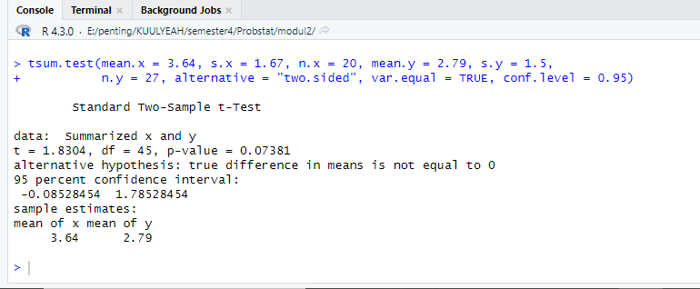
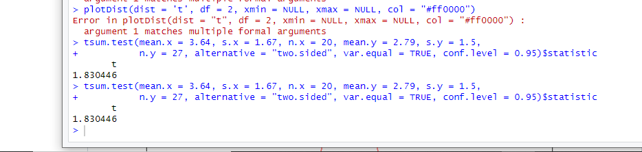
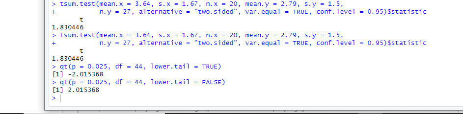

# Prak2_Probstat2023_C_5025211017
Praktikum modul dua probabilitas dan statistika 

| **Nama** | **NRP** | 
| ------------- | :---------: |
| Moh Adib Syambudi  | 5025211017 | 

## Nomer1
Seorang peneliti melakukan penelitian mengenai pengaruh aktivitas 𝐴 terhadap kadar saturasi oksigen pada manusia. Peneliti tersebut mengambil sampel
sebanyak 9 responden. Pertama, sebelum melakukan aktivitas 𝐴, peneliti mencatat kadar saturasi oksigen dari 9 responden tersebut. Kemudian, 9 responden tersebut
diminta melakukan aktivitas 𝐴. Setelah 15 menit, peneliti tersebut mencatat kembali kadar saturasi oksigen dari 9 responden tersebut. Berikut data dari 9
responden mengenai kadar saturasi oksigen sebelum dan sesudah melakukan aktivitas.


Berdasarkan data pada tabel diatas, diketahui kadar saturasi oksigen dari responden ke-3 ketika belum melakukan aktivitas 𝐴 sebanyak 67, dan setelah
melakukan aktivitas 𝐴 sebanyak 70.

* Carilah Standar deviasi dari data selisih pasangan pengamatan tabel diatas

Untuk mencari standar deviasi tersebut, mula-mula disimpan nilai dari tabel yang diatas pada sebuah vector. Kemudian kedua vector tersebut kita operasikan dengan
pengurangan. Hasil operasi ini akan disimpan kedalam variabel standev. Variabel inilah yang dijadikan sebagai parameter dari fungsi sd() untuk mencari nilai dari standar deviasi
```
x <- c(78, 75, 67, 77, 70, 72, 78, 70, 77)
y <- c(100, 95, 70, 90, 90, 90, 89, 100, 100)

selisih <- y - x
standev <- sd(selisih)
```

* Carilah nilai t (p-value)

Mencari nilai tersebut kita gunakan fungsi t.test dengan parameter x dan y. Karena uji hipotesis yang dilakukan bersifat two tail dan menggunakan 2 populasi berpasangan, maka saya menggunakan alternative = two.sided dan paired=TRUE seperti berikut:

```
t.test(y, x, alternative="two.sided",paired=TRUE)$p.value
```

* Tentukanlah apakah terdapat pengaruh yang signifikan secara statistika dalam hal kadar saturasi oksigen , sebelum dan sesudah melakukan aktivitas 𝐴 jika
diketahui tingkat signifikansi 𝛼 = 5% serta H0 : “tidak ada pengaruh yang signifikan secara statistika dalam hal kadar saturasi oksigen sebelum dan sesudah
melakukan aktivitas 𝐴”.


Karena p-value yang didapat (0,0001373) lebih kecil dari nilai siginifikansi, maka H0 ditolak. Oleh karena itu dapat dikatakan bahwa terdapat pengaruh signifikan secara statistik dalam hal kadar saturasi oksigen. 

```
t.test(y, x, paired = TRUE,conf.level = 0.95)
```

## Nomer 2
Diketahui bahwa mobil dikemudikan rata-rata lebih dari 25.000 kilometer per tahun. Untuk menguji klaim ini, 100 pemilik mobil yang dipilih secara acak
diminta untuk mencatat jarak yang mereka tempuh. Jika sampel acak menunjukkan rata-rata 23.500 kilometer dan standar deviasi 3.000 kilometer

* Apakah Anda setuju dengan klaim tersebut? Jelaskan.

$H0 :  mu > 25000$ 
$H1 :  mu   < 25000$ 

Setuju

* Buatlah kesimpulan berdasarkan p-value yang dihasilkan!


Pada output, dapat dilihat bahwa p-value yang dihasilkan berada di atas siginificance level 𝛼=0.05 sehingga dapat diputuskan bahwa H0 diterima. Dengan begitu, dapat disimpulkan bahwa mobil dikemudikan rata-rata lebih dari 25.000 kilometer per tahun.

```
mall <- 25000
n <- 100
mean_x <- 23500
sd_x <- 3000

zsum.test(mean.x = mean_x, sigma.x = sd_x, n.x = n, alternative = "greater",
          mu = mall, conf.level = 0.95)
```

## Nomer 3

Diketahui perusahaan memiliki seorang data analyst yang ingin memecahkan permasalahan pengambilan keputusan dalam perusahaan tersebut. Selanjutnya
didapatkanlah data berikut dari perusahaan saham tersebut. Dari data di bawah berilah keputusan serta kesimpulan yang didapatkan. Asumsikan
nilai variancenya sama, apakah ada perbedaan pada rata-ratanya (α= 0.05)? 


* . H0 dan H1

$H0 :m bandung - m bali = 0$
$H1 :m bandung - m bali != 0$

* Hitung sampel statistik

Uji hipotesis miu pada 2 populasi dengan varian tidak diketahui menggunakan uji statistik t. Sehingga sampel statistik dapat dihitung menggunakan fungsi tsum.test

```
tsum.test(mean.x = 3.64, s.x = 1.67, n.x = 20, mean.y = 2.79, s.y = 1.5, 
          n.y = 27, alternative = "two.sided", var.equal = TRUE, conf.level = 0.95)
```
berdasarkan perhitungan fungsi tersebut akan menghasilkan estimasi sampel


* Lakukan uji statistik (df =2)



* Nilai Kritikal

Nilai kritikal akan dapat dicari menggunakan fungsi qt dengan parameter significance level dibagi 2 yaitu 0.025 karena uji hipotesis ini bersifat two tail



```
qt(p = 0.025, df = 44, lower.tail = TRUE)
qt(p = 0.025, df = 44, lower.tail = FALSE)
```

* Keputusan

Nilai statistik uji t berada di antara dua nilai kritikal sehingga H0 diterima.

* Kesimpulan
Menerima H0 sebagai kebenaran, maka dapat disimpulkan perbedaan rerata antara kedua kota bandung dan bali

## Nomer 4

Data yang digunakan merupakan hasil eksperimen yang dilakukan untuk mengetahui pengaruh suhu operasi (100˚C, 125˚C dan 150˚C) dan tiga jenis kaca
pelat muka (A, B dan C) pada keluaran cahaya tabung osiloskop. Percobaan dilakukan sebanyak 27 kali 

